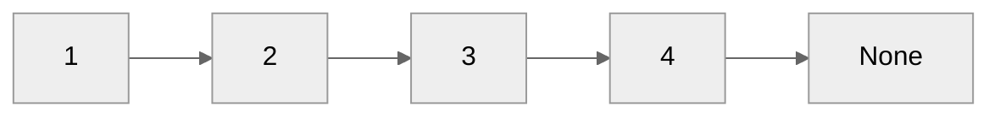

# Основы алгоритмизации и программирования<br>Лекция 5. Структуры данных

Элементарные структуры данных. Односвязный список, двусвязный список. Абстрактные типы данных, интерфейс и реализация. Стек, очередь, дек, множество, куча; моделирование на основе списка и на основе массива.

---

# Элементарные структуры данных

- **Булевый тип данных**: `True` (истина) и `False` (ложь), используется для выполнения логических операций и принятия решений в программе.
- **Указательный тип данных**: содержит адрес памяти, где хранится значение другого типа данных; используется для работы с динамической памятью, аллокации и освобождения памяти, передачи данных между функциями и другими операциями непосредственно с памятью. (отсутствуют в Python)
- **Числовой тип данных**: числовые значения и используются для выполнения математических операций и хранения числовых данных. В различных языках программирования есть разные числовые типы данных, такие как целые числа (integers), числа с плавающей точкой (floating-point), числа с фиксированной точкой (fixed-point) и другие.
- **Символьный тип данных**: представляет отдельные символы или символьные строки (набор символов); используется для хранения и обработки текстовой информации, например, строк текста, обычно включают символы ASCII или Юникода.

---

# Абстрактные типы данных, интерфейс и реализация

**Абстрактный тип данных (АТД)** — некоторая математическая или информационная модель с совокупностью операторов, определенных в рамках этой модели. Например: множество целых чисел с операторами объединения, пересечения и разности множеств.

**Абстрактный тип данных (АТД)** — это тип данных (набор значений и совокупность операций для этих значений), доступ к которому осуществляется только через интерфейс.

**Интерфейс** — заранее определенный набор операций для структуры данных.

**Реализация** — программа содержащая спецификацию АТД.

---

# Односвязный список

**Линейный однонаправленный список** — это структура данных, состоящая из элементов одного типа, связанных между собой последовательно посредством указателей. Каждый элемент списка имеет указатель на следующий элемент. Последний элемент списка указывает на `None`. Элемент, на который нет указателя, является первым (головным) элементом списка. Здесь ссылка в каждом узле указывает на следующий узел в списке. В односвязном списке можно передвигаться только в сторону конца списка. Узнать адрес предыдущего элемента, опираясь на содержимое текущего узла, невозможно.

В информатике линейный список обычно определяется как абстрактный тип данных (АТД), формализующий понятие упорядоченной коллекции данных. На практике линейные списки обычно реализуются при помощи массивов и связных списков.

::center{v-click="1"}



::

---

# Односвязный список

АТД нетипизированного изменяемого списка может быть определён как набор из конструктора и основных операций:

- Операция, проверяющая список на пустоту.
- Три операции добавления объекта в список (в начало, конец или внутрь после любого (n-го) элемента списка);
- Операция, вычисляющая первый (головной) элемент списка;
- Операция доступа к списку, состоящему из всех элементов исходного списка, кроме первого.

---

# Односвязный список. Характеристики

- **Длина списка**. Количество элементов в списке.
- Списки могут быть **типизированными** и **нетипизированными**. Если список типизирован, то тип его элементов задан, и все его элементы должны иметь типы, совместимые с заданным типом элементов списка.
- Список может быть **сортированным** или **несортированным**.
- В зависимости от реализации может быть возможен **произвольный доступ к элементам списка**.

---

# Односвязный список. Реализация

```python {*|1-4|3-4|8-9|11-19|21-25}{maxHeight: '420px'}
class Node:
    def __init__(self, data=None):
        self.data = data
        self.next = None


class LinkedList:
    def __init__(self):
        self.head = None

    def append(self, data):
        new_node = Node(data)
        if self.head is None:
            self.head = new_node
            return
        last_node = self.head
        while last_node.next:
            last_node = last_node.next
        last_node.next = new_node

    def print_list(self):
        cur_node = self.head
        while cur_node:
            print(cur_node.data)
            cur_node = cur_node.next
```

---

# Двусвязный список

**Двусвязный список (двунаправленный связный список)** - ссылки в каждом узле указывают на предыдущий и на последующий узел в списке.

Как и односвязный список, двусвязный допускает только последовательный доступ к элементам, но при этом дает возможность перемещения в обе стороны.

В этом списке проще производить удаление и перестановку элементов, так как легко доступны адреса тех элементов списка, указатели которых направлены на изменяемый элемент.

---

# Применение связанных списков:

- Для построения более сложных структур данных.
- Для реализации файловых систем.
- Для формирования хэш-таблиц.
- Для выделения памяти в динамических структурах данных.

---

# Стек

**Стек (stack — стопка)** — структура данных, представляющая из себя упорядоченный набор элементов, в которой добавление новых элементов и удаление существующих производится с одного конца, называемого вершиной стека. Притом первым из стека удаляется элемент, который был помещен туда последним, то есть в стеке реализуется стратегия «последним вошел — первым вышел» (last-in, first-out — LIFO).

Операции стека:

- `empty` — проверка стека на наличие в нем элементов,
- `push` (запись в стек) — операция вставки нового элемента,
- `pop` (снятие со стека) — операция удаления нового элемента.

---

# Применение стека

- Для реализации рекурсии.
- Для вычислений постфиксных значений.
- Для временного хранения данных, например истории запросов или изменений.

---

# Очередь

**Очередь (queue)** — это структура данных, добавление и удаление элементов в которой происходит путём операций push и pop соответственно. Притом первым из очереди удаляется элемент, который был помещен туда первым, то есть в очереди реализуется принцип «первым вошел — первым вышел» (first-in, first-out — FIFO). У очереди имеется голова (head) и хвост (tail). Когда элемент ставится в очередь, он занимает место в её хвосте. Из очереди всегда выводится элемент, который находится в ее голове.

Очередь поддерживает следующие операции:

- `empty` — проверка очереди на наличие в ней элементов,
- `push` (запись в очередь) — операция вставки нового элемента,
- `pop` (снятие с очереди) — операция удаления нового элемента,
- `size` — операция получения количества элементов в очереди.

---

# Применение очереди

- Для реализации очередей, например на доступ к определённому ресурсу.
- Для управления потоками в многопоточных средах.
- Для генерации значений.
- Для создания буферов.

---

# Дек

**Дек (deque — double ended queue)** — структура данных, представляющая из себя список элементов, в которой добавление новых элементов и удаление существующих производится с обоих концов. Эта структура поддерживает как FIFO, так и LIFO, поэтому на ней можно реализовать как стек, так и очередь. Дек можно воспринимать как двустороннюю очередь.

Дек имеет следующие операции:

- `empty` — проверка на наличие элементов,
- `pushBack` (запись в конец) — операция вставки нового элемента в конец,
- `popBack` (снятие с конца) — операция удаления конечного элемента,
- `pushFront` (запись в начало) — операция вставки нового элемента в начало,
- `popFront` (снятие с начала) — операция удаления начального элемента.

---

# Модуль `deque`

````md magic-move
```py
from collections import deque

# create deque
lst = [1, 2, 3, 4, 5]
dq = deque(lst)
```

```py
from collections import deque

# create deque
dq = deque([1, 2, 3, 4, 5])
```

```py
from collections import deque

# create empty deque
dq = deque()
```

```py
from collections import deque

# create empty deque
dq = deque()

# deque as stack
dq.append(1)
dq.append(2)
dq.append(3)

while dq:
    print(dq.pop())
```

```py
from collections import deque

# create empty deque
dq = deque()

# deque as stack
dq.append(1)
dq.append(2)
dq.append(3)

while dq:
    print(dq.pop())
# 3
# 2
# 1
```

```py
from collections import deque

# create empty deque
dq = deque()

# deque as queue
dq.append(1)
dq.append(2)
dq.append(3)

while dq:
    print(dq.popleft())
# 1
# 2
# 3
```
````

---

# Множество

**Множество (set)** — тип и структура данных в информатике, которая является реализацией математического объекта множество.

Данные типа множество позволяют хранить ограниченное число значений определенного типа без определённого порядка. Повторение значений, как правило, недопустимо. В общем соответствует концепции математического множества. Для этого типа в языках программирования обычно предусмотрены стандартные операции над множествами.

---

# Куча

**Куча (heap)** — это полное двоичное дерево, удовлетворяющее свойству кучи: если узел $A$ — это родитель узла $B$, то ключ узла A больше либо равен ключу узла B.

- Если любой узел всегда больше дочернего узла (узлов), а ключ корневого узла является наибольшим среди всех остальных узлов, это **max-куча**.
- Если любой узел всегда меньше дочернего узла (узлов), а ключ корневого узла является наименьшим среди всех остальных узлов, это **min-куча**.

Применяется для:

- Пирамидальной сортировки
- Алгоритмы поиска
- Алгоритмы на графах (Дейкстры, Прима)
- Очереди с приоритетом

---

# Куча

Полная и почти полная бинарная куча может быть представлена очень эффективным способом с помощью индексного массива. Первый (или последний) элемент будет содержать корень. Следующие два элемента массива содержат узлы-потомки корня. Следующие четыре элемента содержат четверых потомков от двух узлов — потомков корня, и так далее. Таким образом, потомки узла уровня n будут расположены на позициях `2n` и `2n+1` для массива, индексируемого с единицы, или на позициях `2n+1` и `2n+2` для массива, индексируемого с нуля.

| Операция    | найти мин. | добавить | удалить мин. | уменьшить ключ | слияние |
| ----------- | :--------: | :------: | :----------: | :------------: | :-----: |
| Асимптотика |    O(1)    | O(log n) |   O(log n)   |    O(log n)    |  O(n)   |

---

# Модуль `heapq`

````md magic-move
```py
import heapq

lst = [4, 5, 2, 1, 3]
heapq.heapify(lst) # преобразует список в кучу
print(lst)
# [1, 3, 2, 5, 4]
```

```py
import heapq

lst = [4, 5, 2, 1, 3]
heapq.heapify(lst)

heapq.heappush(lst, 2)
print(lst)
# [1, 3, 2, 5, 4, 2]
```

```py
import heapq

lst = [4, 5, 2, 1, 3]
heapq.heapify(lst)

heapq.heappush(lst, 0)
print(lst)
# [0, 3, 1, 5, 4, 2]
```

```py
import heapq

lst = [4, 5, 2, 1, 3]
heapq.heapify(lst)

heapq.heappush(lst, 10)
print(lst)
# [1, 3, 2, 5, 4, 10]
```
```py
import heapq

lst = [4, 5, 2, 1, 3]
heapq.heapify(lst)

while lst:
    print(heapq.heappop(lst))
# 1
# 2
# 3
# 4
# 5
```
````
